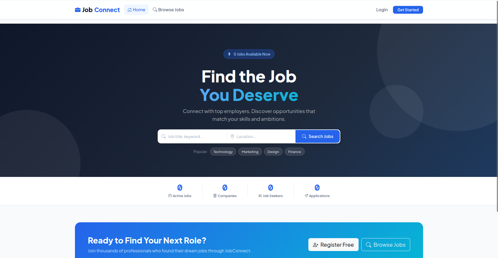

# job-portal-application


A fully-featured Job Portal built with **Python (Flask)**, **SQLite**, **HTML/CSS**, and **Bootstrap 5**.  
Supports three user roles: **Job Seeker**, **Employer**, and **Admin** — each with their own dashboard and permissions.

---

## 📖 About the Project

**JobConnect** is a full-stack web application where:

- **Job Seekers** can register, browse job listings, filter by category/location/type, and apply with a cover letter.
- **Employers** can post new job listings, manage their postings, and review/accept/reject applicants.
- **Admins** get a complete control panel to manage all users, jobs, and applications across the platform.

Built  a  project for learning Flask, this app demonstrates:
- User authentication with hashed passwords
- Role-based access control (RBAC)
- SQLite database with relational tables
- Dynamic Jinja2 templates with template inheritance
- Responsive UI using Bootstrap 5 + custom CSS

---

## ✅ Features

### 👤 Job Seeker
- Register and login securely
- Browse all active job listings
- Search and filter by keyword, location, category, and job type
- View full job details
- Apply with a cover letter (one application per job, enforced at DB level)
- Track all applications and their status in dashboard

### 🏢 Employer
- Register as an employer (with company name)
- Post job listings with title, description, salary, location, category, type
- Edit or remove existing listings
- View all applicants for each job
- Update applicant status: Pending → Reviewed → Accepted / Rejected

### 🛡️ Admin
- View all registered users, jobs, and applications
- Delete users from the platform
- Activate or deactivate any job listing
- Manage application statuses platform-wide
- Statistics overview: total users, jobs, applications

---

## 🛠 Tech Stack

| Layer      | Technology                          |
|------------|-------------------------------------|
| Backend    | Python, Flask                   |
| Frontend   | HTML5, CSS3, Bootstrap 5            |
| Database   | SQLite3 (via Python's sqlite3 lib)  |
| Templating | Jinja2                              |
| Auth       | Werkzeug (password hashing)         |
| Icons      | Bootstrap Icons                     |
| Fonts      | Google Fonts (Plus Jakarta Sans)    |

---

## 📁 Project Structure

```
job_portal/
│
├── app.py                        # Main Flask application (all routes & logic)
├── job_portal.db                 # SQLite database (auto-created on first run)
├── requirements.txt              # Python dependencies
├── .gitignore                    # Files excluded from git
├── README.md                     # This file
│
├── templates/                    # Jinja2 HTML templates
│   ├── base.html                 # Master layout (navbar, footer, flash messages)
│   ├── index.html                # Homepage
│   ├── jobs.html                 # Job listing + search page
│   ├── job_detail.html           # Single job detail view
│   ├── login.html                # Login page
│   ├── register.html             # Registration page
│   ├── apply.html                # Job application form
│   ├── post_job.html             # Employer: post new job
│   ├── edit_job.html             # Employer: edit a job
│   ├── job_applications.html     # Employer: view applicants
│   ├── dashboard_seeker.html     # Seeker dashboard
│   ├── dashboard_employer.html   # Employer dashboard
│   └── dashboard_admin.html      # Admin control panel
│
└── static/
    ├── css/
    │   └── style.css             # Custom styling
    └── js/
        └── main.js               # JavaScript (alerts, counters, interactivity)
```

---

## 🗄️ Database Schema

Three tables with relationships:

```sql
-- Stores all users (seekers, employers, admin)
users (
    id          INTEGER PRIMARY KEY,
    username    TEXT UNIQUE,
    email       TEXT UNIQUE,
    password    TEXT,           -- hashed, NEVER plain text
    role        TEXT,           -- 'seeker', 'employer', or 'admin'
    company     TEXT,           -- only for employers
    created_at  TEXT
)

-- Stores all job listings
jobs (
    id           INTEGER PRIMARY KEY,
    employer_id  INTEGER,       -- FK -> users.id
    title        TEXT,
    company      TEXT,
    location     TEXT,
    category     TEXT,
    salary       TEXT,
    description  TEXT,
    requirements TEXT,
    job_type     TEXT,          -- Full-time, Part-time, Remote, etc.
    is_active    INTEGER,       -- 1 = active, 0 = removed
    created_at   TEXT
)

-- Stores all job applications
applications (
    id           INTEGER PRIMARY KEY,
    job_id       INTEGER,       -- FK -> jobs.id
    seeker_id    INTEGER,       -- FK -> users.id
    cover_letter TEXT,
    status       TEXT,          -- Pending, Reviewed, Accepted, Rejected
    applied_at   TEXT,
    UNIQUE(job_id, seeker_id)   -- prevents duplicate applications
)
```

---

## 🚀 Setup Instructions

### Prerequisites

Make sure you have installed:
- Python 3.8 or higher → [Download Python](https://www.python.org/downloads/)
- pip (comes with Python)
- Git → [Download Git](https://git-scm.com/)

---

### Step 1: Clone the Repository

```bash
git clone https://github.com/SarojPanwar/job-portal-application.git
cd job-portal
```

---

### Step 2: Create a Virtual Environment

```bash
# Create virtual environment
python -m venv venv

# Activate — Windows:
venv\Scripts\activate

# Activate — Mac/Linux:
source venv/bin/activate
```

You will see `(venv)` at the start of your terminal. This means it is active.

---

### Step 3: Install Dependencies

```bash
pip install -r requirements.txt
```

---

### Step 4: Configure the Secret Key

Open `app.py` and find:

```python
app.secret_key = "job_portal_secret_key_change_in_production"
```


```python
# Run this once in Python terminal to get a key:
import secrets
print(secrets.token_hex(32))
# Output: a3f9c2e1b7d4819f23c6e0a5d8b1f7c29...
```

Then use an environment variable (safer than hardcoding):

```python
import os
app.secret_key = os.environ.get("SECRET_KEY", "dev-fallback-only")
```

---

### Step 5: Run the Application

```bash
python app.py
```

Expected output:
```
✅  Database initialized
👤  Admin login: admin@jobportal.com / admin123
🚀  Starting server at http://127.0.0.1:5000
```

Open browser → **http://127.0.0.1:5000**

The database file `job_portal.db` is created automatically on first run.

---

## 📋 How to Use

### As a Job Seeker
1. Click **Get Started** → Register → select "Job Seeker"
2. Browse jobs at `/jobs` — use search and filter bar
3. Click a job → **View Details** → **Apply Now**
4. Write a cover letter and submit
5. Track applications in your **Dashboard** (Pending / Reviewed / Accepted / Rejected)

### As an Employer
1. Register → select "Employer" → enter company name
2. Dashboard → **Post New Job** → fill in all details
3. Dashboard → your job cards → click **Applicants** to see who applied
4. Click **Mark Accepted** or **Mark Rejected** on each applicant

### As an Admin
1. Login with admin credentials
2. Dashboard shows 3 tabs: **Users**, **Jobs**, **Applications**
3. Delete users, toggle job active/inactive, update any application status

---


## 👀 Check User Activity (Admin)

### Method 1: Admin Dashboard (Easiest)
Login as admin → Dashboard → **Users tab**
Shows: all usernames, emails, roles, and registration dates.

### Method 2: SQLite Command Line

```bash
# Open the database
sqlite3 job_portal.db

# View all users
SELECT id, username, email, role, created_at FROM users;

# Count users by role
SELECT role, COUNT(*) as total FROM users GROUP BY role;

# See all applications with user + job info
SELECT u.username, u.email, j.title, a.status, a.applied_at
FROM applications a
JOIN users u ON a.seeker_id = u.id
JOIN jobs j ON a.job_id = j.id
ORDER BY a.applied_at DESC;

# Exit sqlite
.quit
```

## 📸 Screenshots



---


